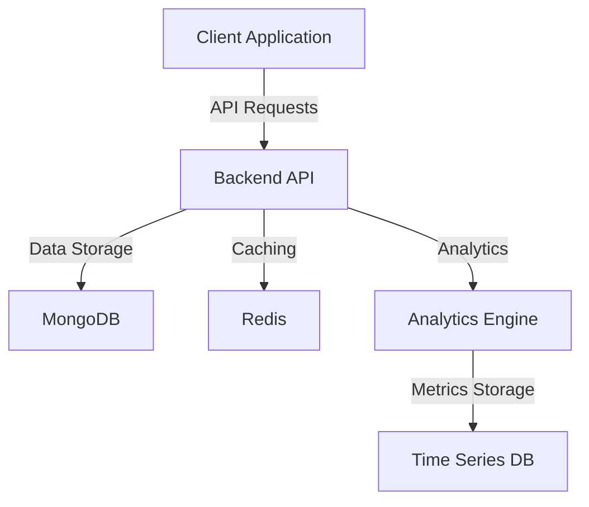

# URL Redirector: Modern Full-Stack URL Management Platform

## Abstract
The URL Redirector is a comprehensive, enterprise-grade URL management platform built with modern web technologies. It provides powerful URL shortening, tracking, and analytics capabilities while maintaining high security and performance standards. The platform supports multiple user roles, detailed analytics, and extensive customization options, making it suitable for both individual users and large organizations.

## Product Overview

### Core Functionality
The URL Redirector transforms long, complex URLs into short, memorable links while providing detailed insights into link performance and user engagement. The platform offers a clean, intuitive interface for managing URLs, viewing analytics, and collaborating with team members.

### Target Audience
- Marketing professionals tracking campaign performance
- Content creators sharing links across platforms
- Businesses managing internal and external links
- Development teams handling API endpoints
- Organizations requiring secure link management

## Key Features

### 1. URL Management
```typescript
interface UrlFeatures {
  shortening: {
    customAliases: boolean;      // Custom URL aliases
    bulkOperations: boolean;     // Bulk URL creation and management
    expirationDates: boolean;    // Automatic link expiration
    passwordProtection: boolean; // Protected URLs
  };
  organization: {
    tags: string[];             // URL categorization
    folders: string[];          // Organizational structure
    search: boolean;            // Advanced search capabilities
    filters: string[];          // Multiple filtering options
  };
}
```

### 2. Analytics & Tracking
```typescript
interface AnalyticsFeatures {
  clickTracking: {
    totalClicks: number;
    uniqueVisitors: number;
    geographicData: Location[];
    deviceInfo: DeviceStats[];
  };
  reporting: {
    customDashboards: boolean;
    exportOptions: string[];
    scheduledReports: boolean;
    dataVisualization: boolean;
  };
}
```

## User Stories

### General Users
1. URL Creation
   ```gherkin
   Feature: Create Short URL
   As a user
   I want to create a shortened URL
   So that I can share a more manageable link
   
   Scenario: Basic URL Shortening
   Given I am logged in
   When I enter a long URL
   Then I receive a shortened version
   And I can immediately use the shortened link
   ```

2. Link Management
   ```gherkin
   Feature: Manage URLs
   As a user
   I want to organize my URLs
   So that I can easily find and manage them
   
   Scenario: Add Tags to URL
   Given I have created a shortened URL
   When I add tags to the URL
   Then I can filter my URLs by those tags
   ```

### Staff Members
1. User Support
   ```gherkin
   Feature: User Management
   As a staff member
   I want to manage user URLs
   So that I can provide support and maintenance
   
   Scenario: Disable Malicious URL
   Given I receive a report about a URL
   When I review and confirm it's malicious
   Then I can disable the URL
   And users are redirected to a warning page
   ```

### Administrators
1. System Management
   ```gherkin
   Feature: System Administration
   As an administrator
   I want to manage the entire system
   So that I can ensure proper operation
   
   Scenario: View System Analytics
   Given I am logged in as admin
   When I access the admin dashboard
   Then I can view system-wide analytics
   And I can monitor system health
   ```

## Technical Architecture

### High-Level Overview


## Security Features

### Authentication & Authorization
- JWT-based authentication
- Role-based access control
- Two-factor authentication support
- Session management
- IP-based access controls

### Data Protection
- End-to-end encryption
- Data anonymization
- GDPR compliance
- Regular security audits
- Automated vulnerability scanning

## Analytics Capabilities

### Click Tracking
- Real-time click tracking
- Geographic location data
- Device and browser information
- Referrer tracking
- Custom event tracking

### Reporting
- Customizable dashboards
- Scheduled reports
- Data export options
- Advanced visualizations
- Trend analysis

## Integration Options

### API Access
```typescript
interface ApiFeatures {
  authentication: {
    apiKeys: boolean;
    oAuth: boolean;
    jwt: boolean;
  };
  endpoints: {
    rest: boolean;
    graphql: boolean;
    webhooks: boolean;
  };
  documentation: {
    swagger: boolean;
    postman: boolean;
    examples: boolean;
  };
}
```

### Third-Party Integrations
- Google Analytics
- Slack notifications
- Email services
- Social media platforms
- CRM systems

## Deployment Options

### Self-Hosted
- Docker containers
- Kubernetes support
- Cloud-provider agnostic
- Automated scaling
- High availability setup

### Cloud-Hosted
- Managed service
- Automatic updates
- Backup management
- Performance optimization
- 24/7 monitoring

## Getting Started

### Prerequisites
- Node.js v18 or higher
- MongoDB v5 or higher
- Redis v6 or higher
- Git

### Quick Start
```bash
# Clone repositories
git clone https://github.com/org/url-redirector-api.git
git clone https://github.com/org/url-redirector-client.git

# Install dependencies
cd url-redirector-api && npm install
cd ../url-redirector-client && npm install

# Start development servers
npm run dev
```

## Support & Documentation

### Resources
- Comprehensive documentation
- API reference
- Video tutorials
- Code examples
- Best practices guide

### Community
- GitHub discussions
- Discord community
- Stack Overflow tag
- Regular webinars
- Developer blog

## Next Steps
Continue to [Module 0: Project Setup](./00-project-setup.md) to begin the implementation journey. 